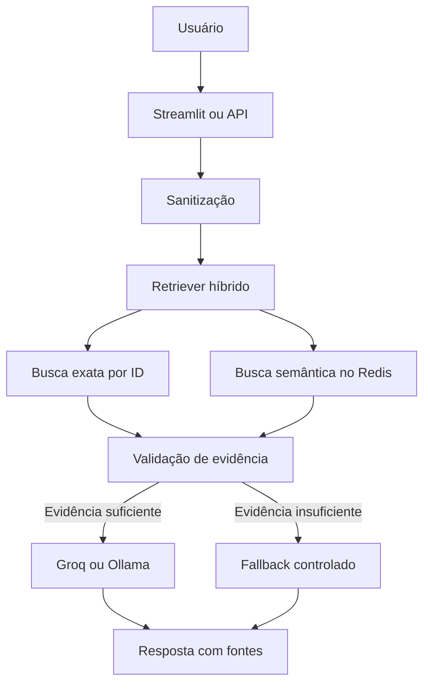

# RAG para consulta inteligente de documentos corporativos

Projeto de portfólio para consulta, sumarização e extração de informações de documentos administrativos usando **RAG**, **LangGraph**, **Redis Vector Search**, **busca híbrida**, **Groq/Ollama**, API e execução local com Docker Compose.

O objetivo é demonstrar uma solução de IA aplicada capaz de responder com base em evidências recuperadas, informar as fontes utilizadas e recusar respostas quando o conteúdo disponível não for suficiente.

> **Status atual:** fluxo RAG, Redis, busca híbrida, fontes, fallback, avaliação controlada, API, Docker Compose e documentação implementados. Observabilidade com MLflow está planejada para a próxima versão.

- Dataset: [Company Documents Dataset — Kaggle](https://www.kaggle.com/datasets/ayoubcherguelaine/company-documents-dataset)
- Documentação e portfólio técnico: [akawamorita.github.io](https://akawamorita.github.io/)

---

## 1. Visão geral

O projeto processa documentos corporativos, como:

- invoices;
- purchase orders;
- shipping orders;
- inventory reports;
- outros documentos administrativos em CSV ou PDF.

A aplicação permite fazer perguntas em linguagem natural e combina duas estratégias de recuperação:

1. **Busca exata por identificadores**, indicada para `order_id`, número de invoice e outros códigos presentes nos documentos.
2. **Busca semântica**, indicada para perguntas descritivas, resumos e consultas sem um identificador explícito.

Os documentos são indexados principalmente no **Redis Vector Search**. O ChromaDB permanece disponível como alternativa configurável para desenvolvimento e comparação.

### Exemplo

Pergunta:

```text
Faça um resumo da invoice referente ao order_id 10386.
```

Resposta esperada:

```text
Resumo da invoice referente ao order_id 10386:

A fatura foi emitida para o cliente FAMIA em 18 de dezembro de 2016 e contém
os produtos Guaraná Fantástica e Sasquatch Ale, totalizando R$ 166,00.

Fontes usadas:
- company-document-text.csv | tipo=invoice | linha=1363 | busca=exact_match
- invoice_10386.pdf | tipo=invoice | busca=exact_match
```

Quando não há evidência suficiente, o fluxo retorna:

```text
Não encontrado no documento com evidência suficiente.
```

---

## 2. Entregas e evolução

| Ordem | Entrega | Status | Importância |
| ---: | --- | :---: | --- |
| 1 | Fluxo LangGraph completo usando Redis | ✅ Concluído | Essencial |
| 2 | Busca híbrida para IDs e semântica | ✅ Concluído | Essencial |
| 3 | Respostas com fontes e fallback | ✅ Concluído | Essencial |
| 4 | Avaliação com perguntas controladas | ✅ Concluído | Essencial |
| 5 | Docker Compose com API | ✅ Concluído | Essencial |
| 6 | README, arquitetura e resultados | ✅ Concluído | Essencial |
| 7 | Observabilidade e tracing com MLflow | 🔄 Próxima versão | 
| 8 | Dashboard e CI/CD | 📋 Planejado | Evolução |

---

## 3. Arquitetura



### Fluxo LangGraph

O LangGraph organiza a execução em etapas explícitas:

1. sanitização da pergunta;
2. identificação de IDs e intenção da consulta;
3. recuperação híbrida do contexto;
4. avaliação da evidência recuperada;
5. geração da resposta ou acionamento do fallback;
6. formatação da resposta com as fontes;
7. registro de métricas operacionais.

Essa estrutura torna o fluxo rastreável, testável e preparado para receber tracing com MLflow.

### Componentes

| Componente | Responsabilidade |
| --- | --- |
| LangGraph | Orquestra os nós e as decisões do fluxo RAG |
| Redis Vector Search | Armazena embeddings, metadados e executa a busca vetorial |
| Retriever híbrido | Combina correspondência exata de IDs com similaridade semântica |
| Hugging Face | Gera embeddings com `sentence-transformers/all-MiniLM-L6-v2` |
| Groq/Ollama | Gera respostas usando o contexto recuperado |
| API | Expõe o fluxo RAG para integração com outras aplicações |
| Streamlit | Disponibiliza a interface de consulta e indicadores operacionais |
| Docker Compose | Executa os serviços locais de maneira reproduzível |
| RedisInsight | Permite inspecionar índices, chaves e documentos armazenados no Redis |

---

## 4. Estrutura principal do projeto

```text
project-rag/
├── data/
│   ├── raw/
│   └── processed/
├── evaluation/
│   └── questions.csv
├── logs/
├── notebooks/
├── src/
│   ├── __init__.py
│   ├── config.py
│   ├── embeddings_factory.py
│   ├── ingest.py
│   ├── retriever.py
│   ├── rag_chain.py
│   ├── evaluator.py
│   ├── monitor.py
│   ├── llm_security.py
│   └── app.py
├── tests/
├── docs/
├── .env.example
├── .gitignore
├── docker-compose.yml
├── mkdocs.yml
├── requirements.txt
└── README.md
```

Arquivos principais:

- `config.py`: centraliza configurações e variáveis de ambiente;
- `embeddings_factory.py`: cria o modelo de embeddings configurado;
- `ingest.py`: carrega, sanitiza, fragmenta e indexa os documentos;
- `retriever.py`: seleciona Redis ou Chroma e executa a busca híbrida;
- `rag_chain.py`: implementa o fluxo RAG com LangGraph;
- `evaluator.py`: executa as perguntas controladas e consolida resultados;
- `monitor.py`: registra e resume métricas operacionais;
- `llm_security.py`: trata entradas e reduz riscos de prompt injection;
- `app.py`: disponibiliza a interface Streamlit.

---

## 5. Decisões técnicas

### Redis como banco vetorial principal

O Redis foi adotado como banco vetorial principal porque permite reunir busca vetorial, filtros por metadados e baixa latência em uma tecnologia amplamente utilizada em aplicações distribuídas. Uma instância separada poderá atuar como broker do Celery na próxima evolução.

### Busca híbrida

A similaridade semântica isolada pode não ser suficiente para códigos como `10386`, `INV-10386` ou outros identificadores. Por isso, o retriever:

- detecta identificadores presentes na pergunta;
- prioriza correspondências exatas quando encontra um ID;
- utiliza busca semântica para complementar o contexto;
- remove resultados duplicados;
- preserva metadados e scores para formar as fontes.

### Respostas fundamentadas

O modelo recebe somente o contexto recuperado e é instruído a não completar informações ausentes. Quando a evidência não atende aos critérios mínimos, o grafo segue para o fallback e não chama o caminho normal de geração.

### Provedores de LLM

- **Groq:** opção externa para respostas mais rápidas durante o desenvolvimento.
- **Ollama:** alternativa local, com maior privacidade e sem dependência de uma API externa.

O nome do modelo deve ser configurado no `.env` conforme os modelos disponíveis na conta Groq ou na instalação local do Ollama.

---

## 6. Pré-requisitos

- Python 3.10 ou superior;
- Docker Desktop com Docker Compose;
- conta e API key do Groq, caso esse provedor seja utilizado;
- Ollama e um modelo local, caso o processamento local seja utilizado;
- Git.

O modelo de embedding padrão é:

```text
sentence-transformers/all-MiniLM-L6-v2
```

> Em máquinas sem GPU dedicada, modelos executados pelo Ollama podem apresentar maior tempo de resposta. O Groq pode ser usado no desenvolvimento mantendo o Redis e os demais serviços localmente.

---

## 7. Configuração

Clone o repositório e acesse sua pasta:

```bash
git clone <URL_DO_REPOSITORIO>
cd <PASTA_DO_REPOSITORIO>
```

Crie o arquivo de configuração a partir do exemplo:

### Windows PowerShell

```powershell
Copy-Item .env.example .env
```

### Linux/macOS

```bash
cp .env.example .env
```

Configure o `.env` sem enviar credenciais ao repositório:

```env
LLM_PROVIDER=groq
GROQ_API_KEY=sua_api_key
GROQ_MODEL=seu_modelo_disponivel

EMBEDDING_PROVIDER=huggingface
HF_EMBEDDING_MODEL=sentence-transformers/all-MiniLM-L6-v2

VECTOR_STORE_PROVIDER=redis
```

Para utilizar o Ollama, altere o provedor e informe um modelo já instalado:

```env
LLM_PROVIDER=ollama
OLLAMA_MODEL=seu_modelo_local
```

---

## 8. Execução com Docker Compose

Suba os serviços locais:

```bash
docker compose up --build -d
```

Verifique o estado dos containers:

```bash
docker compose ps
```

Valide o Redis Vector Search:

```bash
docker compose exec redis-vector redis-cli ping
```

Resposta esperada:

```text
PONG
```

Os serviços são executados na rede interna do Docker. As portas externas podem ser ajustadas no `docker-compose.yml`. Na configuração local adotada para o projeto, o RedisInsight pode ser acessado em:

```text
http://localhost:5540
```

Para acompanhar os logs:

```bash
docker compose logs -f
```

Para encerrar os containers sem apagar os volumes:

```bash
docker compose down
```

> Não utilize `docker compose down -v` quando quiser preservar os índices e documentos persistidos nos volumes.

---

## 9. Execução local com Python

### Windows PowerShell

```powershell
python -m venv .venv
.\.venv\Scripts\Activate.ps1
python -m pip install --upgrade pip
python -m pip install -r requirements.txt
```

### Linux/macOS

```bash
python -m venv .venv
source .venv/bin/activate
python -m pip install --upgrade pip
python -m pip install -r requirements.txt
```

### Ingestão

Coloque os documentos em `data/raw/` e execute:

```bash
python -m src.ingest --reset
```

Esse processo:

- lê os arquivos suportados;
- sanitiza o conteúdo;
- cria chunks com seus metadados;
- gera os embeddings;
- recria o índice quando `--reset` é informado;
- persiste os documentos no banco vetorial configurado.

### Consulta pelo terminal

```bash
python -m src.rag_chain "Faça um resumo do order_id 10386"
```

### Interface Streamlit

```bash
python -m streamlit run src/app.py
```

A interface permite:

- fazer perguntas em linguagem natural;
- visualizar as fontes recuperadas;
- identificar o banco vetorial em uso;
- acompanhar a quantidade de registros indexados;
- consultar indicadores operacionais.

### API

A API é iniciada pelo serviço correspondente no Docker Compose. Após iniciar os containers, consulte a rota de documentação configurada no projeto para testar o JSON retornado e os endpoints disponíveis.

---

## 10. Dataset

O projeto utiliza o [Company Documents Dataset](https://www.kaggle.com/datasets/ayoubcherguelaine/company-documents-dataset). Faça o download manualmente e coloque os arquivos em:

```text
data/raw/
```

O pipeline aceita:

- CSVs com texto extraído;
- PDFs organizados em pastas;
- metadados como tipo do documento, arquivo de origem, linha e identificadores.

O carregador tenta identificar colunas de texto como:

```text
text, extracted_text, ocr_text, content, document_text, texto
```

E colunas de categoria como:

```text
label, category, doc_type, document_type, type, class
```

Se o dataset utilizar nomes diferentes, ajuste o mapeamento em `src/ingest.py`.

---

## 11. Avaliação controlada

A avaliação utiliza perguntas conhecidas, respostas esperadas e casos sem evidência para validar o comportamento do pipeline.

Execute:

```bash
python -m src.evaluator
```

Quando os testes estiverem organizados com Pytest:

```bash
python -m pytest -v
```

Critérios avaliados:

- recuperação correta por ID;
- recuperação semântica;
- presença das fontes;
- termos esperados na resposta;
- estrutura do JSON retornado pela API;
- acionamento correto do fallback;
- latência e similaridade dos documentos recuperados.

O objetivo dessa etapa não é avaliar apenas se o texto parece adequado, mas verificar se a resposta está fundamentada nos documentos corretos.

### Cenários principais

| Cenário | Comportamento esperado |
| --- | --- |
| Pergunta com `order_id` existente | Priorizar busca exata e retornar as fontes correspondentes |
| Pergunta descritiva | Utilizar busca semântica e retornar evidências relevantes |
| Pergunta sem evidência | Retornar o fallback sem inventar informações |
| Entrada com instrução maliciosa | Sanitizar ou bloquear a tentativa de prompt injection |

---

## 12. Resultados funcionais

Os testes realizados até esta versão demonstram:

- recuperação correta de documentos por identificadores conhecidos, incluindo o `order_id 10386`;
- combinação de busca exata e semântica no mesmo retriever;
- retorno das fontes com arquivo, tipo, linha, chunk, estratégia de busca e score quando disponíveis;
- fallback determinístico para perguntas sem evidência suficiente;
- possibilidade de alternar o banco vetorial por configuração;
- execução reproduzível dos serviços locais com Docker Compose;
- avaliação automatizada com perguntas controladas.

Métricas quantitativas consolidadas serão acrescentadas ao projeto conforme o conjunto de avaliação for ampliado. Essa decisão evita apresentar percentuais sem uma base de testes representativa.

---

## 13. Guardrails

O projeto implementa controles de segurança e qualidade:

- sanitização das perguntas e dos documentos ingeridos;
- tratamento dos documentos recuperados como conteúdo não confiável;
- prompt orientado a responder apenas com base no contexto;
- critérios mínimos de evidência antes da geração;
- fallback explícito quando a evidência é insuficiente;
- inclusão obrigatória das fontes recuperadas;
- registro de erros, consultas sem evidência e tentativas suspeitas;
- credenciais mantidas fora do código por variáveis de ambiente.

Esses controles reduzem riscos, mas não substituem políticas corporativas de segurança, autenticação, autorização e proteção de dados.

---

## 14. Observabilidade com MLflow — próxima versão

A próxima entrega adicionará tracing do LangGraph com MLflow, sem alterar as responsabilidades atuais do Redis.

Escopo planejado:

- visualização da execução de cada nó;
- latência total e por etapa;
- modelo e provedor utilizados;
- banco vetorial selecionado;
- documentos, metadados e scores recuperados;
- uso do fallback;
- tokens, quando disponibilizados pelo provedor;
- erros e status da execução;
- resultados das avaliações controladas;
- comparação entre versões de prompts e configurações.

O Redis continuará responsável pela busca vetorial. O MLflow será responsável por experimentos, métricas e traces.

---

## 15. Competências demonstradas

### IA generativa e RAG

- LangChain e LangGraph;
- Redis Vector Search;
- embeddings e chunking;
- busca híbrida;
- engenharia de prompts;
- Groq e Ollama;
- respostas fundamentadas e fontes;
- guardrails contra prompt injection.

### Avaliação e observabilidade

- perguntas controladas;
- testes de recuperação e resposta;
- similaridade e latência;
- taxa de fallback;
- logs estruturados;
- planejamento de tracing com MLflow.

### Engenharia

- Python;
- API e JSON;
- Pytest;
- Docker Compose;
- RedisInsight;
- Streamlit;
- modularização e configuração por ambiente;
- documentação com MkDocs;
- arquitetura preparada para CI/CD.

### Aplicação de negócio

- redução do tempo de consulta documental;
- rastreabilidade de evidências;
- suporte à decisão;
- automação de rotinas administrativas;
- aplicação em processos de ERP, financeiro e backoffice.

---

## 16. Storytelling do projeto — STAR

### Situação

Empresas lidam diariamente com grande volume de documentos administrativos. A consulta manual consome tempo, aumenta o risco de erro e dificulta a rastreabilidade da informação usada em uma decisão.

### Tarefa

Construir um protótipo capaz de localizar informações por identificadores e significado, responder com evidências e impedir respostas sem suporte documental.

### Ação

Foi criado um pipeline modular com ingestão, embeddings, Redis Vector Search, retriever híbrido, orquestração com LangGraph, guardrails, fallback, API, interface Streamlit, testes controlados e execução com Docker Compose.

### Resultado

O protótipo recupera documentos por ID e similaridade semântica, apresenta fontes rastreáveis e rejeita perguntas sem evidência suficiente. A arquitetura também permite substituir provedores e evoluir para observabilidade com MLflow, processamento assíncrono com Celery e CI/CD.

---

## 17. Documentação com MkDocs

Para executar a documentação localmente:

```bash
mkdocs serve
```

Acesse:

```text
http://127.0.0.1:8000
```

Para gerar a versão estática:

```bash
mkdocs build
```

---

## 18. Limitações atuais

- o dataset utilizado é público e o projeto possui finalidade de estudo e portfólio;
- a qualidade depende da extração textual e dos metadados disponíveis;
- modelos locais podem apresentar maior latência em máquinas sem GPU adequada;
- os critérios de evidência precisam ser recalibrados quando o domínio ou o modelo de embedding muda;
- autenticação avançada, tracing com MLflow, Celery e pipeline de CI/CD ainda fazem parte do roadmap.

---

## 19. Próximos passos

- [x] Implementar o fluxo completo com LangGraph e Redis;
- [x] Implementar busca híbrida para IDs e semântica;
- [x] Retornar fontes e fallback controlado;
- [x] Criar avaliação com perguntas conhecidas;
- [x] Disponibilizar API e Docker Compose;
- [x] Documentar arquitetura, execução e resultados;
- [ ] Adicionar observabilidade e tracing com MLflow;
- [ ] Ampliar dashboard e automatizar testes com CI/CD.

---

## Autor

**Alexandre Kawamorita**  
Machine Learning Engineer | Data Scientist | Python | SQL | LLMs | Forecasting | IA Aplicada

- [LinkedIn](https://www.linkedin.com/in/alexandrekawamorita/)
- [Portfólio técnico](https://akawamorita.github.io/)
