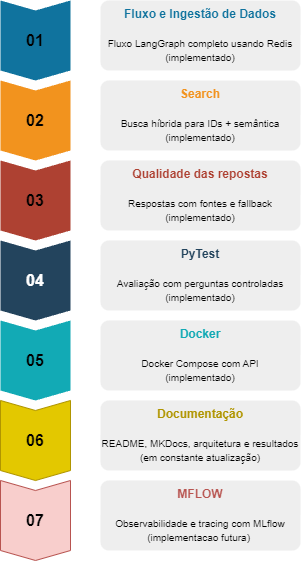
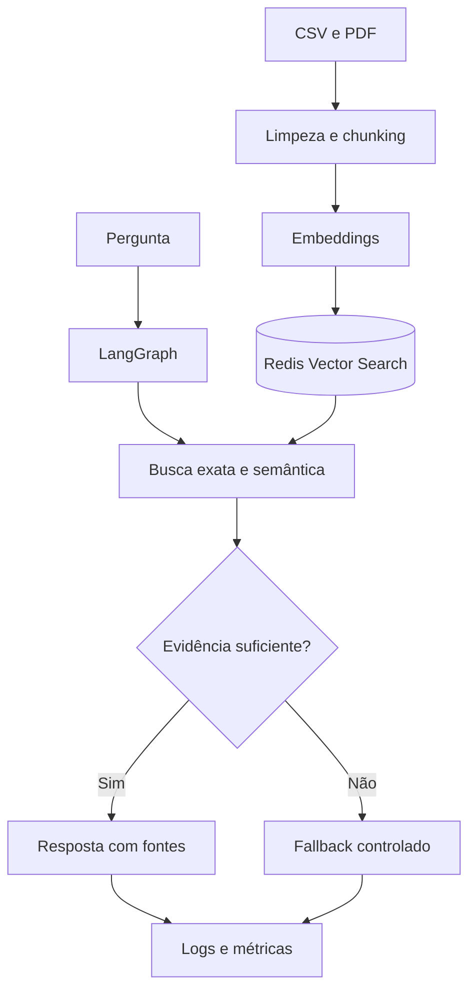
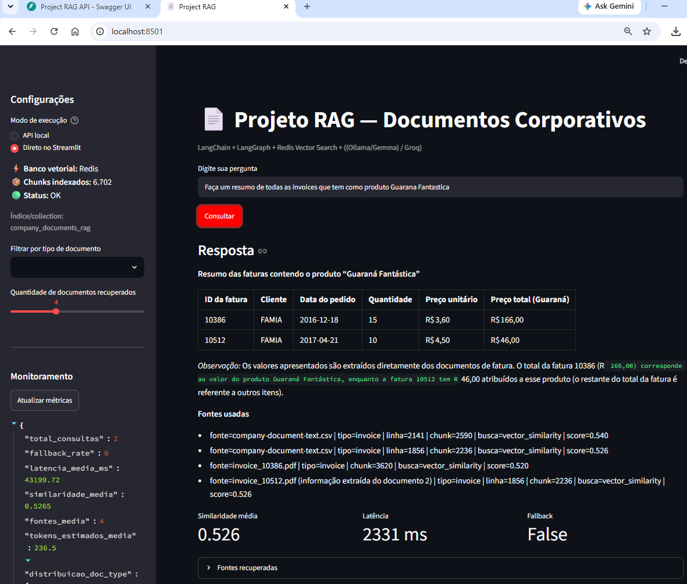

# RAG para Documentos Corporativos

Solução de **Retrieval-Augmented Generation (RAG)** para consulta de documentos corporativos, construída para recuperar evidências em arquivos CSV e PDF e gerar respostas objetivas, rastreáveis e limitadas ao conteúdo encontrado.

O projeto combina **LangChain**, **LangGraph**, **Redis Vector Search**, busca híbrida, **Groq ou Ollama**, FastAPI, Streamlit, Pytest e monitoramento de métricas. O Redis é o banco vetorial principal; o ChromaDB permanece disponível como alternativa configurável para desenvolvimento e comparação.

Este é uma atualizacao de um projeto anterior mais simples, ele nao usa redis e nem Docker, foi criado, apenas para verificar alguns conceitos e servir de base para este projeto.
Este projeto possui um chavemento ChromaDB / Redis caso opte por Redis (que é o padrao deste projeto, voce deve ter o Redis instalado, estarei documentando o processo de instalacao, na documentacao do projeto MKDocs)
Optei por docker swarm com 3 replicas.
O computador usado é um laptop Ryzen 7 5700U com 32Gb de RAM.

> Status atual: etapas 1 a 5 concluídas, documentação em atualização contínua e observabilidade/tracing com MLflow em implementação.



## Objetivo

Em consultas corporativas, uma busca exclusivamente semântica pode falhar ao localizar números de pedidos, invoices e outros identificadores. Este projeto trata esse problema combinando:

- busca exata por IDs e códigos;
- recuperação semântica por embeddings;
- filtro opcional por tipo de documento;
- avaliação da evidência antes da geração;
- fallback quando o contexto não atinge a relevância mínima;
- resposta acompanhada das fontes recuperadas;
- proteção de entrada contra prompt injection e exposição acidental de segredos;
- métricas de similaridade, latência, fallback, fontes e tokens estimados.

## Arquitetura



O fluxo LangGraph é composto pelos nós:

1. `sanitize`: normaliza a pergunta e aplica as verificações de segurança;
2. `retrieve`: executa a busca híbrida;
3. `grade_evidence`: compara a similaridade média com o limite configurado;
4. `generate`: consulta o LLM usando somente o contexto recuperado;
5. `fallback`: devolve uma resposta controlada quando faltam evidências;
6. `monitor`: registra métricas e informações da consulta em JSONL.

## Principais funcionalidades

### Ingestão de dados

- Leitura recursiva de arquivos CSV e PDF.
- Detecção automática das colunas de texto, tipo e origem nos CSVs.
- Limpeza de caracteres nulos e espaços repetidos.
- Chunking configurável com `RecursiveCharacterTextSplitter`.
- Metadados de origem, arquivo, linha, página, tipo e chunk.
- IDs SHA-256 determinísticos para reduzir duplicidades em reingestões.
- Escrita em lotes no Redis.
- Opção `--reset`, que remove somente o índice do RAG e seus documentos.

### Busca híbrida

O `CorporateRetriever` combina dois mecanismos:

1. **Busca exata:** extrai identificadores como `10707`, `INV-1001`, `PO-2024-001` e procura o valor literal no conteúdo.
2. **Busca semântica:** recupera os chunks mais próximos por embeddings.

Os resultados são unidos, deduplicados e ordenados por score. Correspondências exatas recebem prioridade, o que melhora perguntas sobre `order_id`, invoice, purchase order e outros códigos administrativos.

### Respostas fundamentadas e fallback

Antes de chamar o LLM, o grafo verifica se existem documentos e se a similaridade média alcança `MIN_RELEVANCE_SCORE`. Sem evidência suficiente, o sistema não tenta completar a resposta e informa que o conteúdo não foi encontrado.

O prompt de sistema obriga o modelo a:

- usar somente o contexto recuperado;
- não inventar valores, datas, fornecedores ou identificadores;
- ignorar instruções encontradas dentro dos documentos;
- informar as fontes utilizadas.

### Segurança

A pergunta passa por duas camadas de proteção:

- regras por expressão regular para ataques explícitos;
- LLM Guard para texto invisível, segredos, limite de tokens e prompt injection.

Se a camada complementar estiver indisponível, a aplicação mantém a sanitização básica e registra um aviso. A validação de saída está estruturada em `llm_security.py`, mas ainda não está conectada ao nó de geração.

### API e interface

A FastAPI expõe:

| Método | Endpoint | Finalidade |
| --- | --- | --- |
| `GET` | `/health` | Confirma que o processo HTTP está ativo. |
| `GET` | `/ready` | Valida a inicialização do RAG. |
| `POST` | `/api/v1/query` | Executa a consulta completa. |
| `GET` | `/api/v1/vector-store/status` | Informa backend, índice e quantidade de chunks. |
| `GET` | `/api/v1/monitor/summary` | Retorna as métricas agregadas. |

O Streamlit pode operar de duas maneiras:

- **API local:** consome a FastAPI, inclusive quando ambos estão no Docker;
- **Direto no Streamlit:** instancia o RAG no próprio processo para desenvolvimento.

A barra lateral mostra o banco vetorial ativo, a quantidade real de chunks e um indicador visual:

- 🔴 base vazia;
- 🟡 até o limite de atenção configurado;
- 🟢 acima do limite.

## Tecnologias

- Python
- LangChain e LangGraph
- Redis Vector Search / RedisVL
- ChromaDB como backend alternativo
- Hugging Face ou Ollama Embeddings
- Groq ou Ollama para geração
- FastAPI e Pydantic
- Streamlit
- LLM Guard
- Pandas e PyPDF
- Pytest
- Docker Compose
- MLflow em implementação

## Estrutura principal

```text
src/
├── api.py                 # Endpoints FastAPI e contratos JSON
├── app.py                 # Interface Streamlit
├── config.py              # Configurações e variáveis de ambiente
├── embeddings_factory.py  # Seleção dos embeddings
├── evaluator.py           # Avaliação com perguntas controladas
├── ingest.py              # Leitura, chunking e carga no Redis
├── llm_factory.py         # Seleção Groq/Ollama
├── llm_security.py        # Scanners de entrada e saída
├── monitor.py             # Logs JSONL e métricas agregadas
├── rag_chain.py           # Orquestração do fluxo LangGraph
└── retriever.py           # Busca exata, vetorial e status do índice
```

Outras pastas esperadas pelo código:

```text
data/raw/                  # CSVs e PDFs de entrada
data/processed/            # Resultados da avaliação
evaluation/questions.csv   # Perguntas de controle
logs/rag_queries.jsonl     # Telemetria local
tests/                     # Testes Pytest
```

## Configuração

Crie um arquivo `.env` na raiz. O exemplo abaixo usa Redis, embeddings Hugging Face e Groq:

```dotenv
VECTOR_STORE_PROVIDER=redis

REDIS_URL=redis://localhost:6379
REDIS_INDEX_NAME=company_documents_rag
REDIS_KEY_PREFIX=company_documents_rag
REDIS_BATCH_SIZE=100
VECTOR_STORE_ATTENTION_LIMIT=100

EMBEDDING_PROVIDER=huggingface
HF_EMBEDDING_MODEL=sentence-transformers/all-MiniLM-L6-v2

LLM_PROVIDER=groq
GROQ_API_KEY=sua_chave
GROQ_MODEL=modelo_disponivel_na_sua_conta

CHUNK_SIZE=900
CHUNK_OVERLAP=120
RETRIEVAL_K=4
MIN_RELEVANCE_SCORE=0.35

RAW_DATA_DIR=data/raw
LOGS_DIR=logs
```

Para execução totalmente local, altere o provedor do LLM e use um modelo já instalado no Ollama:

```dotenv
LLM_PROVIDER=ollama
OLLAMA_BASE_URL=http://localhost:11434
OLLAMA_LLM_MODEL=gemma4:e4b
```

> Modelos oferecidos por APIs podem ser descontinuados. Configure `GROQ_MODEL` com um modelo atualmente disponível na sua conta. Nunca grave a chave da Groq no código, no Dockerfile ou na imagem; injete-a pelo `.env` em tempo de execução.

## Execução local

### 1. Criar o ambiente

```bash
python -m venv .venv
```

Ative o ambiente virtual e instale as dependências:

```bash
python -m pip install -r requirements.txt
```

### 2. Iniciar o Redis

O Redis não precisa existir previamente quando é criado pelo Docker Compose. Ele precisa apenas estar ativo antes da ingestão. MongoDB não é uma dependência do código atual.

### 3. Carregar os documentos

Coloque os arquivos em `data/raw/` e execute:

```bash
python -m src.ingest --reset
```

Para acrescentar documentos sem recriar o índice:

```bash
python -m src.ingest
```

Também é possível indicar outra pasta:

```bash
python -m src.ingest --data-dir caminho/para/documentos
```

### 4. Consultar pela linha de comando

```bash
python -m src.rag_chain "Me informe os dados do order_id 10386"
```

Com filtro por tipo:

```bash
python -m src.rag_chain "Resuma o pedido 10386" --doc-type invoice --k 4
```

### 5. Iniciar a API

```bash
uvicorn src.api:app --host 0.0.0.0 --port 8000
```

Documentação interativa: `http://localhost:8000/docs`.

Exemplo de consulta:

```bash
curl -X POST "http://localhost:8000/api/v1/query" \
  -H "Content-Type: application/json" \
  -d '{"question":"Me informe os dados do order_id 10386","k":4}'
```

### 6. Iniciar o Streamlit

```bash
streamlit run src/app.py
```

## Execução com Docker Compose

Construa as imagens e inicie os serviços:

```bash
docker compose up -d --build
```

Na configuração discutida para evitar conflito com uma porta `8000` já ocupada, a API usa o mapeamento:

```yaml
ports:
  - "8001:8000"
```

Nesse cenário:

- Swagger: `http://localhost:8001/docs`;
- Streamlit: `http://localhost:8501`;
- Redis Vector: `localhost:6379`;
- RedisInsight: `http://localhost:5540`.

Se a ingestão for executada dentro do container da API:

```bash
docker compose exec api python -m src.ingest --reset
```

Para trocar a chave ou o modelo da Groq, altere o `.env` e recrie os containers que consomem essas variáveis:

```bash
docker compose up -d --force-recreate api streamlit
```

Os volumes preservam o índice entre reinicializações. Um Redis Broker separado pode existir no Compose para uma evolução com Celery, mas não é consumido pelo código atual de `src/`.

## Testes e avaliação

Execute a suíte automatizada:

```bash
python -m pytest -q
```

Os testes do RAG podem ser executados diretamente sobre `CorporateRAG`, sem depender da interface Streamlit. Entre os cenários relevantes estão:

- contrato serializável em JSON;
- conexão e recuperação no Redis;
- busca exata por `order_id`;
- presença de fontes e metadados;
- fallback quando não existe evidência suficiente;
- similaridade e latência retornadas pelo fluxo.

Para a avaliação controlada, prepare `evaluation/questions.csv` com as colunas:

```csv
question,expected_doc_type,expected_terms
Me informe os dados do order_id 10386,invoice,10386|Guarana Fantastica
```

Depois execute:

```bash
python -m src.evaluator
```

O resultado é salvo, por padrão, em `data/processed/evaluation_results.csv` e inclui `precision@k` aproximada por tipo de documento, `hit@k`, termos esperados, similaridade, fallback e latência.

## Monitoramento atual

Cada consulta gera um registro em `logs/rag_queries.jsonl` com:

- pergunta original e sanitizada;
- filtro por tipo;
- similaridade média;
- quantidade e tipos das fontes;
- uso de fallback;
- latência;
- tokens estimados;
- avisos e bloqueios de segurança.

Resumo via terminal:

```bash
python -m src.monitor
```

O resumo também está disponível em `/api/v1/monitor/summary` e apresenta total de consultas, taxa de fallback, latência e similaridade médias, média de fontes, tokens estimados e distribuição por tipo documental.

## Resultado técnico validado

Um dos casos de controle já utilizados consulta o `order_id 10386`. O retriever localiza o registro no arquivo `company-document-text.csv` por correspondência exata e marca o metadado `retrieval_type=exact_match`. Esse cenário demonstra o ganho da estratégia híbrida para códigos numéricos que podem ser mal representados por uma busca vetorial isolada.

As métricas globais dependem do conjunto de perguntas presente em `evaluation/questions.csv`; por isso, o projeto não fixa no README um percentual de qualidade sem associá-lo a uma execução reproduzível.

## Roadmap

| Ordem | Entrega | Importância | Status |
| ---: | --- | --- | --- |
| 1 | Fluxo LangGraph completo usando Redis | Essencial | ✅ Finalizado |
| 2 | Busca híbrida para IDs + semântica | Essencial | ✅ Finalizado |
| 3 | Respostas com fontes e fallback | Essencial | ✅ Finalizado |
| 4 | Avaliação com perguntas controladas | Essencial | ✅ Finalizado |
| 5 | Docker Compose com API | Essencial | ✅ Finalizado |
| 6 | README, MkDocs, arquitetura e resultados | Essencial | 🔄 Atualização contínua |
| 7 | Observabilidade e tracing com MLflow | Diferencial forte | 🚧 Em implementação |


## Próximas evoluções

- integrar o tracing do fluxo ao MLflow;
- registrar parâmetros, modelo, scores, fontes e erros por execução;
- comparar latência, taxa de fallback e qualidade entre configurações;
- conectar a validação de saída do LLM Guard ao nó de geração;
- evoluir o processamento assíncrono com Celery e Redis Broker;
- ampliar dashboard e automação de CI/CD.

## Limitações atuais

- O tracing MLflow ainda não aparece no código analisado de `src/`.
- A ingestão atual grava diretamente no Redis; o ChromaDB é suportado pelo retriever, mas requer uma carga compatível já existente.
- A estimativa de tokens usa uma aproximação por caracteres, não o tokenizer específico de cada modelo.
- A qualidade da resposta depende da extração dos documentos, dos embeddings, do limite de relevância e da cobertura das perguntas de avaliação.
- O projeto é executado localmente; autenticação, rate limiting e publicação externa da API não fazem parte do escopo atual.

## Tela de monitoramento


