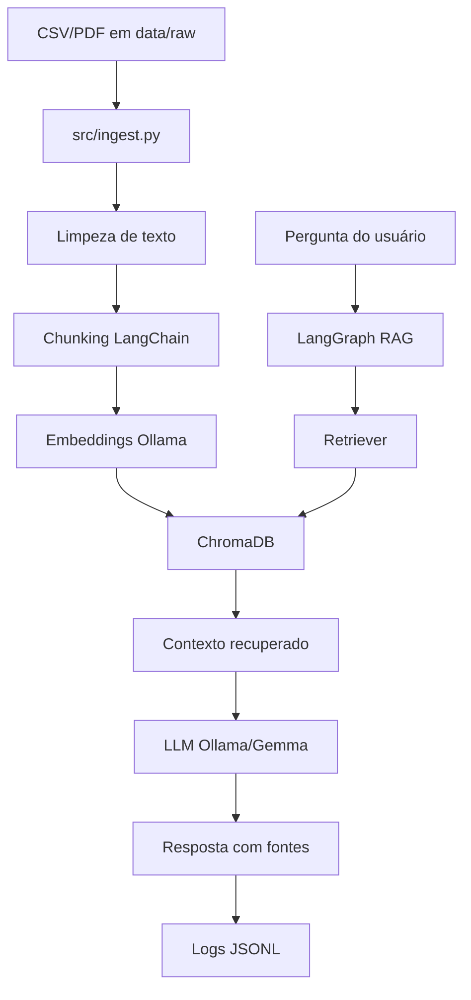

# Arquitetura

## Visão geral

O projeto segue uma arquitetura modular para facilitar manutenção, testes e evolução.

## Módulos

### `src/ingest.py`

Responsável por carregar documentos, limpar texto, criar chunks e persistir embeddings no ChromaDB.

### `src/retriever.py`

Isola a busca semântica. Permite filtro por tipo de documento e retorna score de similaridade.

### `src/rag_chain.py`

Implementa o fluxo de RAG com LangGraph:

1. sanitização da pergunta;
2. recuperação semântica;
3. verificação de evidência;
4. geração de resposta;
5. monitoramento.

### `src/evaluator.py`

Executa avaliação com perguntas de controle e gera métricas simples.

### `src/monitor.py`

Registra consultas em JSONL e calcula métricas agregadas.

### `src/app.py`

Interface Streamlit para demonstração.

## Decisões técnicas

### Por que ChromaDB?

ChromaDB é simples para protótipos, funciona localmente e permite persistência em disco. Para portfólio, demonstra bem os conceitos de vector store, embeddings e busca por similaridade.

### Por que LangGraph?

LangGraph permite representar o RAG como um fluxo de estados. Isso facilita adicionar decisões, como fallback quando não há evidência suficiente.

### Por que Ollama/Gemma?

Ollama facilita execução local de LLMs. Isso reduz dependência de APIs externas e permite demonstrar uma arquitetura privada para documentos corporativos.

## Guardrails

O projeto inclui controles simples:

- resposta apenas com base no contexto;
- fallback quando a similaridade é baixa;
- instrução para ignorar comandos presentes dentro dos documentos;
- sanitização de padrões básicos de prompt injection;
- rastreabilidade das fontes usadas.
